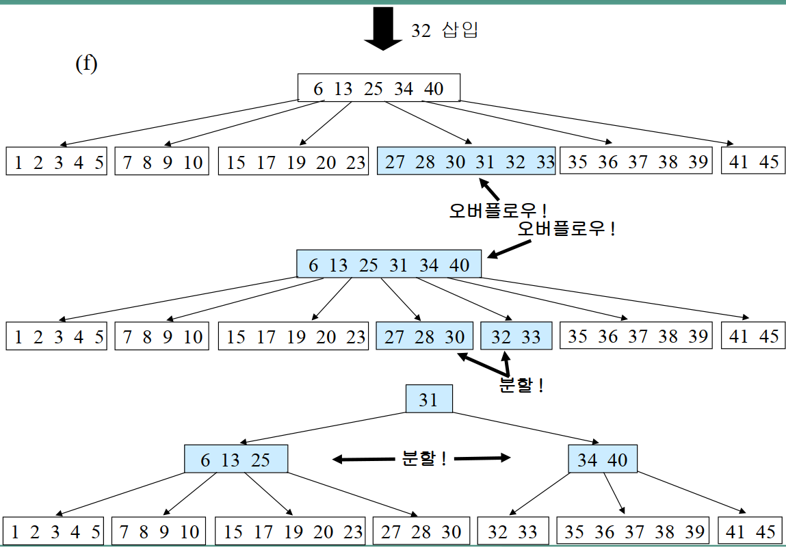
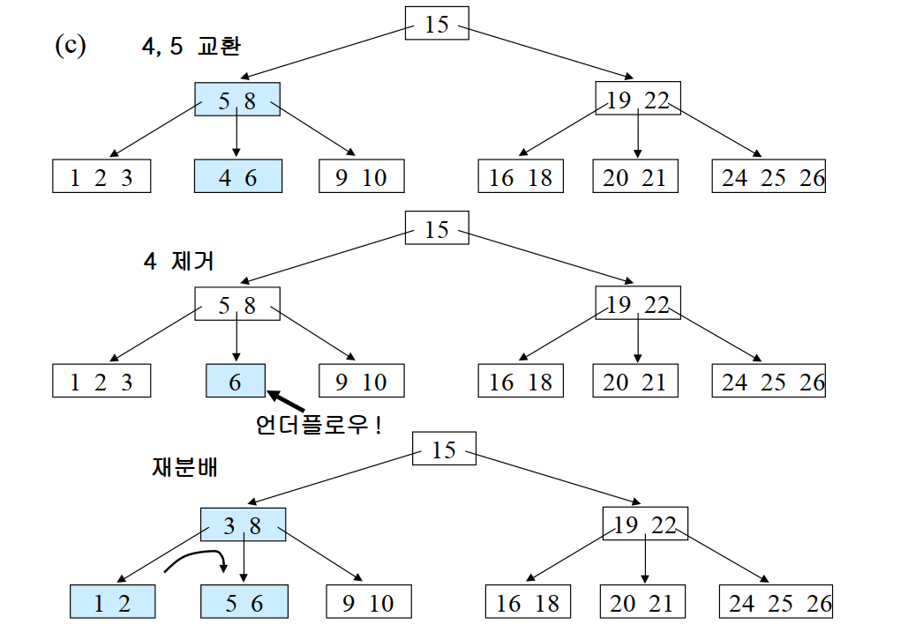
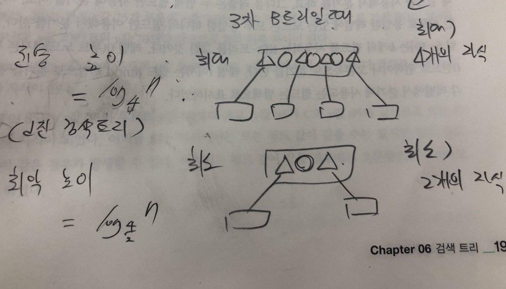

# B-트리 

2020.02.18

## 정의
 검색 트리가 방대하면 검색 트리를 모두 메모리에 올려놓고 사용할 수가 없음  
 검색 트리의 분기 수를 늘리면 검색 트리의 기대 깊이를 낮출 수 있음  
 분기의 수가 2개를 넘으면 **다진 검색 트리**이며, B-트리의 한개 노드에는 최대 k개까지의 키가 크기 순으로 저장되어 있음  
 키가 k개이면 이 노드는 k+1개의 자식을 가짐  
 각각에 대응되는 서브 트리를 T0, T1, ... , Tk라 하면 서브트리 Ti의 모든 키들은 keyi-1보다 크고 keyi보다 작다  

## 특성 정리(쉽게)
- 노드의 데이터 수가 n개라면 자식 노드의 개수는 n+1개이다
- 노드의 데이터는 반드시 정렬된 상태여야 한다
- 노드의 자식노드들의 데이터들은 노드 데이터를 기준으로 데이터보다 작은 값은 왼쪽 서브 트리에, 큰값들은 오른쪽 서브 트리에 저장되어야 한다
- root노드가 자식이 있다면 2개 이상을 가져야 하며, root를 재외한 노드는 적어도 M/2개의 데이터를 가지고 있어야 함
- 이 말인 즉슨 == 분기의 수를 가능하면 늘리되 균형을 맞추기 위해 각 노드가 채울 수 있는 최대 허용량의 반 이상의 키는 채워야 하는 검색 트리라는 말!
- ex) 노드의 최대 데이터수가 3개라면 3차 비트리인데, 그렇다면 자식 노드들에는 최소한 3//2인 1개의 데이터가 있어야 한다. 4개라면 4차, 자식노드에는 4//2인 2개 데이터가 있어야함.

 ## 검색
 키 x에 대한 검색은 기본적으로 이진 검색트리의 검색과 같음. 이진 검색트리에는 각 노드에 키가 하나밖에 없지만, B-트리에는 최대 k까지의 키를 가질 수 있음.  
 이진 검색트리에서는 검색키가 노드의 키와 일치하는 것이 있는지 확인하는 반면, B-트리에서는 노드의 여러 키 중 검색키와 일치하는 것이 있는지 확인.  
 이진 검색 트리에서는 유일한 키와 비교하여 왼쪽 또는 오른쪽 분기를 정하는 반면, b-트리에서는 keyi-1 < x < keyi인 두 키를 찾아 분기를 해야 할 자식을 찾는다.  
 자식으로 분기를 하고 나면 깊이만 하나 내려간 똑같은 검색 문제가 된다.  

 ## 삽입
 1. x를 삽입할 리프 노드 r을 찾는다
 2. 노드 r에 공간의 여유가 있으면 키를 삽입하고 끝냄
 3. 노드 r에 여유가 없으면 형재 노드를 살펴 공간의 여유가 있으면 형제 노드에 키를 하나 넘기고 끝냄
 4. 형제 노드에 키를 추가했을 때 정렬이 깨질 경우, 키 하나를 부모 노드로 할당하고 부모 노드의 키 하나를 자식으로 전달해 정렬된 상태로 유지한다.   
 5. 형제 노드에 여유가 없으면 가운데 키를 부모 노드로 넘기고 노드를 두개로 분리, 분리 작업은 부모 노드에서의 삽입 작업을 포함
 6. 이 때 오버플로의 기준은 **n차 비트리에서 한 노드의 키 갯수가 n개를 넘겼을 때**

## 삭제
1. x를 키로 갖고 있는 노드를 찾는다
2. 이 노드가 리프 노드가 아니면 x의 직후 원소 y를 가진 리프 노드 r을 찾아 x와 y를 맞바꾼다
3. 리프에서 x를 제거한다
4. 언더플로우 발생시 우선 키를 가져올 수 있는 형제 노드가 있는지 보고 그런 노드 있으면 가져와 채우고 끝낸다
5. 형제 노드에서 키를 가져올 때 정렬이 깨진다면 부모노드에게 키 하나 주고 부모노드에서 키 하나 가져와서 정렬을 유지한다(삽입과 같음)
6. 이거까지 안되면 병합해야함. 병합할때는 자식 노드 하나가 줄어드니 부모 노드의 키 중 하나가 필요 없고, 이 필요없는 키와 두 노드를 합쳐 하나의 노드로 만든다
7. 언더플로의 기준은 n차 비트리에서 **리프노드 하나에 n//2개 이하의 자식이 있는 상황**

  
*요 예제는 보다시피 6개의 리프노드를 가진 5차 비트리이며, 최대 5개의 키가 들어가고 최소 2개의 키가 들어가 있어야 한다.

## 성능
2진 검색트리가 균형을 아주 잘 맞추면 높이가 log2n에 근접하는 것처럼, d진 검색트리는 균형을 아주 잘 맞추면 높이가 logdn에 근접할 수 있음(밑이 d인 로그임)  
b-트리에서 임의의 노드가 최대 d개의 자식을 가질 수 있다면 최소한 d/2개의 자식은 가져야 한다(루트는 예외)  
b-트리의 깊이는 최악의 경우에도 log d/2 n보다 깊을 수는 없다. logdn과 logd/2n사이 어디인가에서 결정 될 것  
(글씨 안예뻐서 ㅈㅅ...)
  
실질적으로 비트리 작업들 수행시간은 디스크 접근 횟수를 기준으로 하는데, 노드를 메인 메모리에 가져온 다음 수행하는 작업에 소요되는 시간은 접근 시간에 비하면 무시할 수 있을 정도로 작음

---
그래서 결론  
검색 : O(logn)  
삽입 : O(logn)
삭제 : O(logn)  
b트리 작업들은 모두 점근적으로는 O(logn)으로 쓸 수 있지만 이진 검색트리에 비해 상수 인자가 상당히 적다 => 높이가 logn이 되는게 보장되어 있는 균형이진검색트리이기 때문이당..
