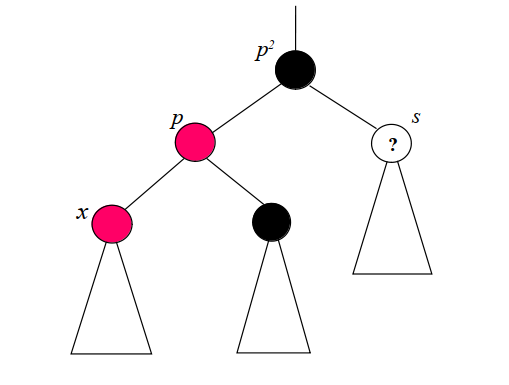
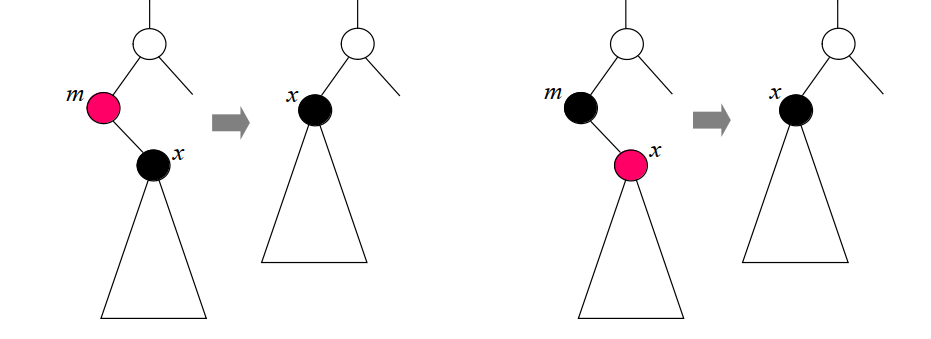
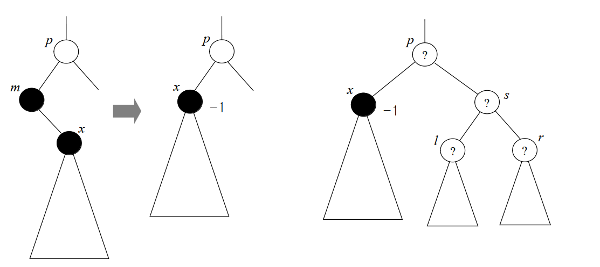
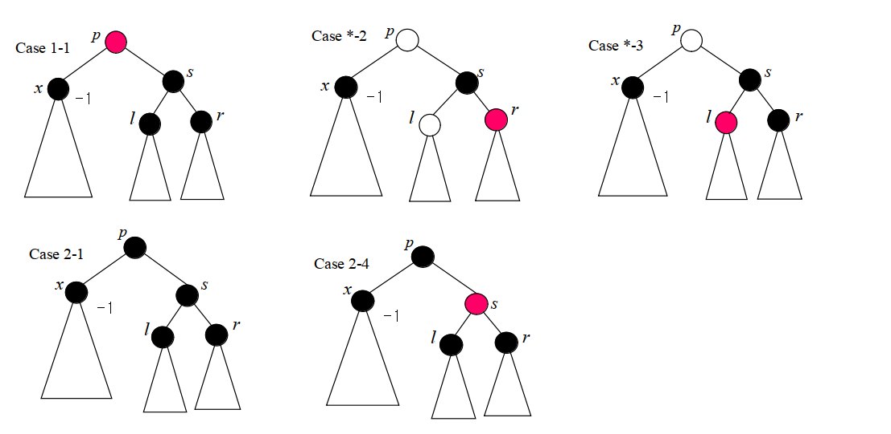
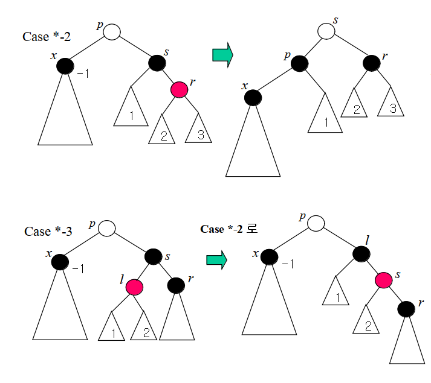
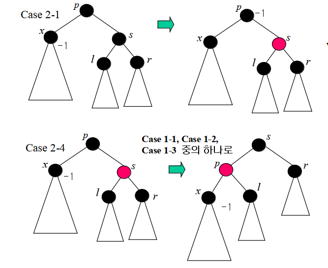

# 레드블랙트리
2020.02.16  
악명높은 자료구조

## 정의
레드블랙트리는 균형이진탐색트리 = 탐색과 저장을 O(logn)에 수행한다  
레드블랙트리는 4가지의 성질을 만족함  
>1. 루트는 블랙이다
>2. 모든 리프는 블랙이다
>3. 노드가 레드이면 그 노드의 자식은 반드시 블랙이다
>4. 루트 노드에서 임의의 리프 노드에 이르는 경로에서 만나는 블랙 노드의 수는 같다 : 이거 때문에 log(n)으로 유지

여기서 말하는 리프노드는 **자식이 없는 빈 곳일경우 무조건** NIL이라고 친다  
삽입과 삭제가 기본적으로는 이진 검색트리와 동일하지만, 삽입이나 삭제 후 레드 블랙 특성을 위반하는 경우가 발생 가능  
이때는 적절한 작업을 통해 특성을 만족하도록 바로잡아 주어야 함  

## 삽입
이진 검색 트리의 삽입 알고리즘에 따라 삽입을 하고, 새 노드의 색상을 **레드로 칠한다**  
=> 가장 밑에 매달리므로 레드블랙 특성에서 문제가 생기지는 않음, 삽입된 노드의 위쪽과 관련해서 문제가 생기는지만 확인  
1. x의 부모 노드 p가 블랙이면 그것으로 삽입은 완료
2. x의 부모 노드 p가 레드이면 레드가 레드의 자식이 될 수 없으므로 해결 필요  
=> p의 부모 노드는 이때 반드시 블랙임(p2), 그리고 삽입 노드의 형제 역시 반드시 블랙
=> 여기서 경우가 나눠지는 경우는 p의 형제노드인 s. s가 무슨 색이냐에 따라 경우를 나눔  

### case 1
s가 레드일 때  
1. p와 s의 색상을 레드에서 블랙으로 바꾼다(p2기준으로 좌우에 블랙이 하나더 늘어남)
2. p2의 색상을 블랙에서 레드로 바꾼다
3. p2가 루트라면 색상을 다시 블랙으로 바꾸고 끝낸다
4. 루트가 아니라면 p2의 부모 색상을 확인해야 함. p2의 부모 색상이 블랙이면 레드 블랙 특성이 모두 만족된다. p2의 부모 색상이 레드이면 레드의 자식이 레드가 못되므로 똑같은 문제 발생. => 원래 x에서 발생했던 문제가 p2에 대해서 발생했음을 뜻함 => p2을 문제발생 노드로 하여 재귀적으로 다시 시작

### case 2
s가 블랙일 때  
1. p를 중심으로 왼쪽으로 회전함 
=> x가 레드고 p가 레드인 상황에서 부모자식 관계만 뒤바뀐 상태이므로 여전히 성질을 만족하지 못함  
2. p2을 중심으로 오른쪽으로 회전하고 p와 p2의 색상을 맞바꾼다

** case 2를 만나면 2-2의 수선을 마지막으로 상황이 종료, case1을 만나면 상황이 끝날 수도 있고 재귀적으로 루트까지 올라가며 색깔을 바꿔야 할 수도 있다

## 삭제
이진 검색 트리에서의 삭제 방법에 따라 노드를 삭제한 후 색상을 맞추어줌  
일반적인 경우) 삭제할 노드 d가 자식이 둘이면 d의 오른쪽 서브 트리에서 최소 원소를 가진 노드 m의 키를 노드 d로 옮긴 다음 노드 m을 삭제하면 됨  
=> 노드 d의 색상을 건드리지 않은 채 키만 바뀌는 것은 레드 블랙 특성에는 영향을 미치지 않으니까 뭐 ㄱㅊ  

### 간단한 경우
1. m이 레드이면 삭제 후 아무런 조치가 필요 없음 - m이 자식 x를 가지고 있는 경우에도, m이 레드일 때는 어짜피 x가 블랙일 테니까 괜찮고, m이 블랙이고 x가 레드일 때도 x를 끌어올리고 블랙으로 바꿔주면 어짜피 괜찮다
2. 즉, 삭제 노드가 레드이면 문제가 없고 + 삭제 노드가 블랙이라도 유일한 자식이 레드이면 문제가 없다  

### 까다로운 경우
m과 x가 모두 블랙이라면? ~~벌써 에반데;~~  

m과 x가 블랙인 상태에서 m이 삭제되면 x는 m의 부모 p의 자식이 되고, 루트에서 x를 통과하는 경로의 블랙 노드 개수가 한개 모자라서(4번 위반) 특성이 깨진다  

일단 그림처럼 x의 부모를 p, x의 형제를 s, s의 두 자식을 각각 l과 r이라 할 때,  
pslr의 색상 분포에 따라 여러가지 경우로 나누어 처리한다  

#### p가 red
p가 레드이면 일단 s는 반드시 블랙  
나머지 l,r은 <블랙, 블랙>/<레드, 레드><블랙, 레드>/<레드, 블랙>  
이중 <레드레드>랑<블랙레드>는 알고리즘에서 통합해서 처리해서 하나로 본다(????)  

#### p가 black
p가 블랙이면 s/l/r의 경우의 수가 총 4가지가 나옴  
<b,b,b>, <b,r,r><b,b,r>, <b,r,b>, <r,b,b>  

이렇게 해서 총 7가지의 경우의 수가 나온다 할 수 있는데, p의 색상은 처리 방법에 영향을 미치지 않으므로 통합하여 총 5가지의 경우의 수에 대해 알고리즘이 처리한다  

**관건은 블랙이 하나 부족한 x까지의 경로에 블랙 하나 보충하기!!**

#### 1-1
p와 s의 색상을 맞바꾼다. x에 이르는 경로상에서 블랙이 하나 추가되었으므로  
x에 이르는 경로에서 블랙 노드가 모자라던 것이 해소

#### *-2
1. p를 중심으로 왼쪽으로 회전시키고
2. p와 s의 색상을 바꾼 다음
3. r의 색상을 레드에서 블랙으로 바꾼다
x에 이르는 경로상에서 블랙이 하나 추가되었으므로, x를 지나는 경로에서 블랙 노드가 하나 모자라던 것이 해소

#### *-3
s를 중심으로 오른쪽으로 회전시킨 뒤, l과 s와 색상을 맞바꿈

#### 2-1
싹다 블랙인 경우인데  
s의 색상을 블랙으로 바꿈 => 이 상황은 s를 지나가는 경로에서도 블랙 하나가 모자라게 되서 => 원래 x에 대해서 발생했던 문제가 p로 올라가게 됨  
p를 문제노드로 다시 보고 p의 형제노드인 s'를 레드로 바꿔주고 => 재귀적으로 계속 수행

#### 2-4
p를 중심으로 왼쪽으로 회전시킨 후, p와 s의 색상을 바꾼다  
l과 r을 경유하는 경로와 관련해서는 문제가 없는데, 문제가 발생한 x의 부모 노드의 색상이 블랙에서 레드로 바뀌었으므로 case 1에 해당함  
1-1, 1-2, 1-3중에 하나의 솔루션을 적용  

## 성능
일단 레드블랙트리의 깊이는 최악의 경우에도 O(logn)임이 보장됨  
1. 키의 총수가 n이라는 것은 레드블랙트리의 내부 노드 개수가 n임을 뜻함
2. 색상을 고려하지 않고 가장 이상적으로 꽉 채워진 트리의 깊이는 logn + 1, 아무리 잘 만들어져도 블랙 노드의 개수는 이를 넘을 수 없음
> **왜 꽉 채워진 트리 깊이가 logn임?**
꽉 채워진 트리 1층은 1개, 2층은 2개, 3층은 4개, 4층은 8개....
층이 h라고 할 때, 
2^0 + 2^1 + 2^2 + ... + 2^h+1 = 2^h+1 - 1 <= n
양변에 로그 취해서 시간복잡성 구하면 log n <= h
3. 특성3에 따라 레드 노드는 두개 연속해서 존재할 수 없으므로 루트에서 임의의 리프에 이르는 경로에서 블랙 노드의 개수보다 많을 수 없음(블랙 노드의 최대 개수인 logn + 1을 생각해보면 그것보다 많을 수 없음)
4. 그러므로 루트에서 임의의 경로의 길이는 2(logn + 1)을 넘을 수가 없음(레드도 최대고 블랙도 최대일 때의 경우를 상정 logn + 1이 두개!!)
5. 즉 높이는 log n

---

그러므로 최악의 경우  

**검색** : log n  
**삽입, 삭제** : 상수 ~ log n  

시간 걸림