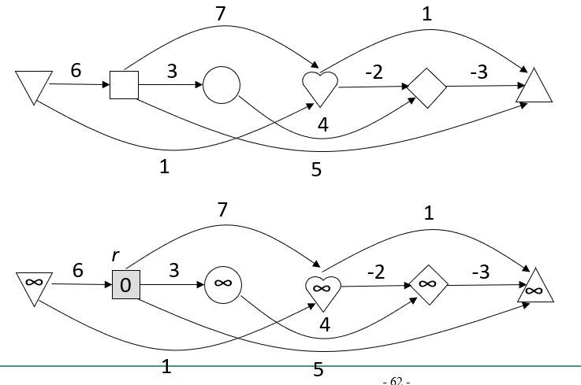

# 최단 경로 알고리즘 

## 최단경로문제 유형
1. 모든 가중치가 음이 아닌 일반적인 경우
    - 다익스트라
2. 음의 가중치가 존재
    - 벨만-포드
3. 단일 시작점 최단경로 vs 모든 쌍 최단경로
- 가중치 합이 음인 사이클은 절대 허용하지 않음 - 음의 사이클이 있으면 해당 사이클을 몇번이고 돌아 경로의 가중치 합을 무한정 낮출 수 있으므로

## 다익스트라

### 동작

1. 시작 정점 r만 최단 거리 0으로 초기화, 다른 정점들은 모두 무한으로 설정
2. 정점 r을 s의 첫번째 원소로 포함시키고(visited), 인접한 정점들을 살피면서 이르는 거리를 정점에 기록해둠(d[]에)
3. d[]에서 최소값을 리턴, 최솟값을 가지고 있는 정점을 visited에 넣는다
4. 그 정점에서 인접한 정점들을 살피는 것을 계속 반복하고, 계속 다른 정점으로 이동하여 visited의 원소들이 다 찰 때까지 반복한다
5. *이때 현재 방문한 정점은 간선 따라가는게 아니라 그냥 최소값으로만 이동한다. 화살표 따라 가는게 아님. 약간 노드 중심 알고리즘이라고 해도 맞을 듯
6. prev에는 어디서 왔는지, 이전의 방문 노드를 기록한다(이거 다 이어주면)

### 수행시간
1. 정점마다 인접한 간선들을 모두 검사하는 작업 -> O(E)
2. 우선순위 큐, 혹은 min을 구할 수 있는 자료구조에 원소를 넣고 삭제하는 작업 -> 상수시간
3. 우선순위 큐에 삽입될 수 있는 정점은 최대 V^2인데, 자료구조 크기에 따라 시간 복잡도를 줄일 수 있다 => O(V^2) ~ O(log V)
4. 프림 알고리즘과 로직이 거의 같다

## 벨만-포드
### 동작

간선을 최대 1개 사용하는 최단 경로, 2개 사용하는 최단 경로... 식으로 간선을 최대 n-1개를 사용하는 최단 경로까지 구해나간다(간선 중심)

1. 시작정점 r을 0, 나머지 무한대
2. **모든 간선을 한 번씩 다 살피면서** 해당 간선으로 앞에서 설정한 최단거리가 더 짧아질 수 있는지 보기 : 최초에는 시작 정점에 연결된 세 정점만 변동이 생김
3. 이런식으로 계속 반복. 최단 경로가 발생하지 않는 반복 루프에서는 별 변동사항 없이 끝냄
4. 음의 사이클이 존재하면 문제 자체가 성립하지 않음. 간선들을 모두 보면서 최단거리를 확정하고 나서, 다시 모든 간선을 보고 릴랙스를 시킬 때 최단거리의 변동이 생기면 음의 사이클이 존재하는 것으로 본다

### 수행시간
1. for 루프는 O(V)만큼 반복
2. 각 간선을 모두 보므로 에지 for루프는 O(E)만큼 반복
3. 그외는 상수시간
4. 두 for루프가 합쳐져서 총 O(VE)시간이 소요

## 모든 쌍 최단경로(플로이드-워샬)
### 동작

모든 정점 쌍 사이의 최단경로를 구하는 방법. 구해야할 최단 경로가 모두 n^2개임(자신에게서 자신으로의 경로도 포함)

1. i에서 j까지의 최단경로를 찾는 상황에서, 정점 집합 [1,2, ... k]에서 중간 경로에 정점 k가 포함되있는 경우와 그렇지 않은 경우로 나눠서 둘 중에 최소값이 최단경로가 된다
2. 정점 집합을 상정하고 이렇게 최단경로를 찾으면 마지막 for루프 안의 동작은 상수시간에 수행할 수 있다 => O(n^3)으로 수행 마침

## 사이클이 없는 그래프(DAG)의 최단 경로
### 동작
DAG에서는 모든 정점을 한 줄로 늘어놓을 때, 뒤에 위치한 정점부터 앞에 위치한 정점으로 가는 간선은 존재하지 않도록 하는 정점들의 순열이 존재 => 위상 정렬 이용

1. DAG를 위상정렬하면(당연한 이야기지만) 한줄에 다 들어온다
2. 시작 정점을 제외하고 무한대로 초기화
3. 위상 정렬 순서대로 처음부터 순서대로 릴랙스
4. 위상정렬 후 dag 그래프에는 출입 간선이 없는 정점이 가장 먼저 오므로, 그 정점에 대해서는 최단경로가 무한대로 남아 존재하지 않게 된다

### 수행시간
1. for루프는 O(V)
2. 위상정렬 O(V+E)
3. 릴랙스 상수시간
4. for 루프 두개는 u로부터 연결된 정점들의 집합을 에지를 통해 한번씩 방문하므로 O(V+E)

즉, O(V+E)으로 선형시간으로 다익스트라 알고리즘이나 벨만포드보단 빠르다(당연한이야기;)